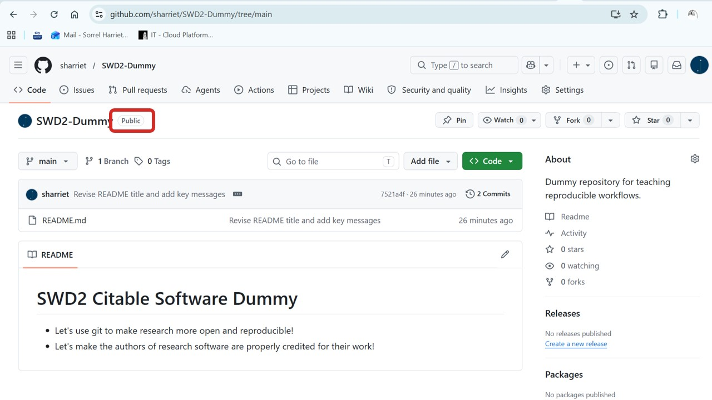
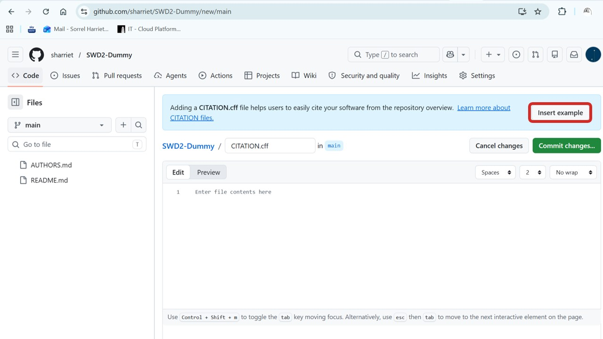
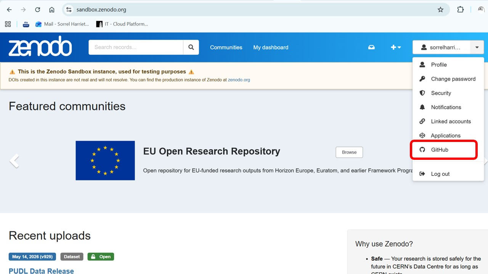
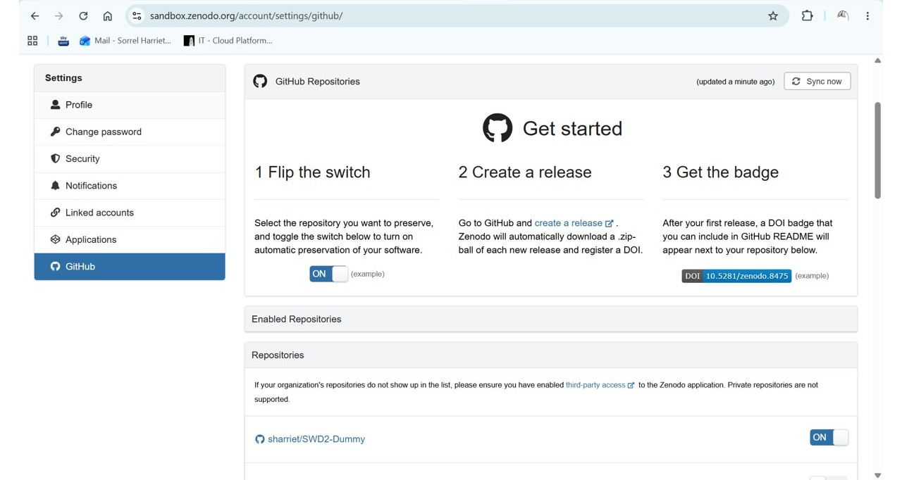
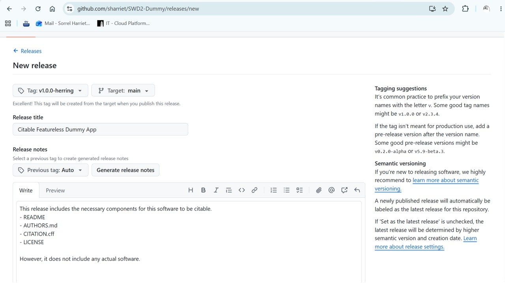
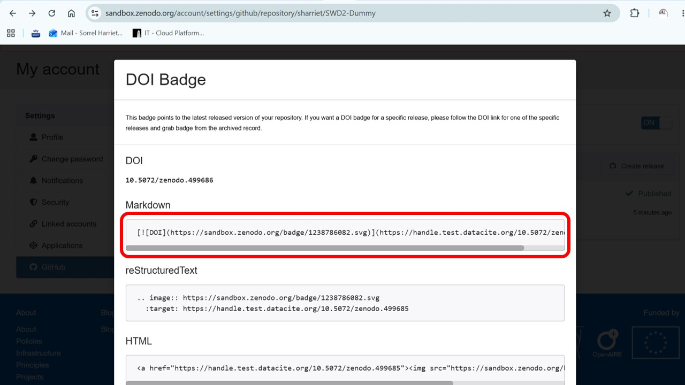

This practical walks you through the steps to make your research software or script citable.

Making your research software citable means that others can credit your work precisely, and that your contribution is traceable through the systems used for research assessment, impact reporting, and exercises such as REF.

It also supports reproducibility by linking specific releases of your software to your publications.

---

## Before you start

Your code needs to be in a GitHub repository and the repository will need to be **public**.

:::{.callout-tip}
**Practising these steps?** We recommend using a dummy repository to try this out before applying it to a real project.
:::

The visibility of your repository is displayed next to its name:



If your repository is not yet public, you can change the visibility via **Settings**.

---

## Step 1: Add an AUTHORS.md file

Create a new file in the root of your repository called `AUTHORS.md`. This file sets out how you are defining authorship on your project and lists the authors.

→ Go to **Add File → Create New File** and name it `AUTHORS.md`.

There is no single required format for this file, but it should include:

- A clear statement of your authorship criteria for this project
- A list of authors with their name, ORCID, institution, and faculty or school

:::{.callout-note}
Including ORCIDs and institutional affiliations helps with record matching between systems, which is important for traceability and impact reporting.
:::

Here is an example you can adapt:

```markdown
# Authors

## Authorship criteria

Authors listed here have made a significant intellectual contribution to
the design or development of this software. This includes researchers
who shaped key design decisions, as well as RSEs and developers who
built the software. Authorship criteria were agreed by the project team
at the outset.

## Author list

- Jane Smith
  - ORCID: https://orcid.org/0000-0000-0000-0000
  - University of [Institution], Faculty of [Faculty], School of [School]

- Arjun Patel
  - ORCID: https://orcid.org/0000-0000-0000-0001
  - University of [Institution], Faculty of [Faculty], School of [School]
```

→ Once you are happy with the content, commit your new file.

:::{.callout-warning}
**When doing this for real:** have a conversation with your project team early on about how you are agreeing to define authorship. This helps avoid conflict or confusion later on. For more on this topic, including templates and examples, visit our [Knowledge Centre](https://arc.leeds.ac.uk/knowledge-centre/how-to-make-your-research-software-citable/).
:::

---

## Step 2: Add a CITATION.cff file

A `CITATION.cff` file tells others how to cite your software. Once added, GitHub will display a **"Cite this repository"** button on your repository's homepage, making it easy for others to get a correctly formatted citation.

When you later connect to Zenodo (Step 4), this file will also be used to populate the author list on your Zenodo record — which in turn creates entries on contributors' ORCID profiles.

→ Create a new file in the root of your repository called `CITATION.cff`. When you type the `.cff` extension, GitHub will recognise it and offer to insert an example — go ahead and select **Insert Example**.



This gives you pre-formatted placeholder text to edit. Here is an example of what a completed file might look like:

```yaml
cff-version: 1.2.0
message: "If you use this software, please cite it as below."
title: "My Research Software"
authors:
  - family-names: Smith
    given-names: Jane
    orcid: "https://orcid.org/0000-0000-0000-0000"
    affiliation: "University of [Institution]"
  - family-names: Patel
    given-names: Arjun
    orcid: "https://orcid.org/0000-0000-0000-0001"
    affiliation: "University of [Institution]"
version: 1.0.0
date-released: 2025-01-01
repository-code: "https://github.com/[your-username]/[your-repo]"
license: MIT
```

Your author list here should reflect your `AUTHORS.md` file.

Full documentation of all available fields is available from the [Citation File Format documentation](https://citation-file-format.github.io/).

→ Once you are happy with the content, commit your file.

---

## Step 3: Add a LICENSE file

Zenodo will look for a licence file when creating your record. Adding a licence also tells others what they are permitted to do with your software.

→ Go to **Add File → Create New File** and name it `LICENSE`. GitHub will automatically offer you the option to choose a licence template, with a helpful summary of the permissions and limitations of each type.

:::{.callout-warning}
**Pause here if you are working on a real software repository.**

Without a licence, default copyright laws apply and others cannot legally use your code. There are several open source licence types permitting different things — visit [choosealicense.com](https://choosealicense.com) to find the right one for your situation.

There may also be valid reasons not to open source your software (e.g. commercial potential, or sensitive data that cannot be decoupled). If in doubt, seek advice first from the Library or the Research and Innovation Service, and continue practising on a dummy repository until you are sure.
:::

For this tutorial, we are using the **MIT licence** as an example — a widely used, permissive open source licence.

→ Once you have selected your licence template, commit the new file.

---

## Step 4: Connect your repository to Zenodo

[Zenodo](https://zenodo.org) is an open research repository that will automatically generate a Digital Object Identifier (DOI) for your software each time you create a release on GitHub. It does this using a **webhook** — a mechanism that allows GitHub to automatically notify Zenodo whenever a release event occurs.

:::{.callout-important}
**For learning purposes**, use [Zenodo Sandbox](https://sandbox.zenodo.org) rather than the live site. This lets you safely try things out without generating real DOIs.
:::

→ Log in to [Zenodo Sandbox](https://sandbox.zenodo.org) using your GitHub account. If you are a member of multiple organisations, you can choose which to grant Zenodo access to.

:::{.callout-note}
If your organisation is hosted on the University's GitHub Enterprise account, you will be prompted to authenticate using SSO (single sign-on).
:::

→ Once logged in, navigate to the **GitHub** page in your Zenodo account settings.



This page lists repositories that Zenodo has access to. If your repository is not listed, it may be because:
    - The repository visibility is not set to public, or
    - It belongs to an organisation that has not yet authorised the Zenodo app. In this case, contact your organisation's administrator.

→ Toggle your repository **on**. Zenodo will now listen for release events on that repository.



:::{.callout-note}
**Keeping your webhook secret up to date**

GitHub and Zenodo communicate via a webhook secured with a secret token. This is set automatically when you connect your repository, but you may be required to update it periodically. You can do this from your repository's **Settings → Webhooks**. You only need to set a new secret on the GitHub side — there is nothing to update in Zenodo when doing this.
:::

---

## Step 5: Create a release on GitHub

Creating a release is the event that triggers Zenodo to generate your DOI.

→ From the root of your repository on GitHub, navigate to **Releases → Draft a new release**.



From here:

+ **Create a version tag** — for example `v1.0.0`. You can also add a suffix for pre-releases (e.g. versions intended for testing and feedback are often given a name, sometimes following a theme).
+ **Add a title** — this should summarise what is new or significant about this release, so it is easy to identify later.
+ **Add release notes** — include more detail about what has been updated or added, and why it matters. This is also a useful way to communicate progress to non-technical stakeholders, such as a PI.

→ Once you are ready, publish the release. Zenodo will automatically archive it and generate a DOI, which will appear in your Zenodo record shortly afterwards.

:::{.callout-note}
This process also automatically generates downloadable archives of your source code, which you can use when depositing into Symplectic or another research repository.
:::

---

## Step 6: Add badges to your README

Adding badges to your README gives other developers an instant visual signal that your software is citable and openly licensed. This fosters trust in open source communities and may make it more likely that others will use and cite your work.

**To add a DOI badge:**

→ Go to your repository's record in Zenodo
→ Click on the DOI badge
→ Copy the markdown snippet



→ Paste the snippet into your `README.md`.

You can also add a licence badge — you will find a link to a suitable gist for the MIT licence badge [here](https://gist.github.com/lukas-h/2a5d00690736b4c3a7ba).

---

## You're done — but traceability doesn't stop here

Your software is now citable and your contribution is becoming more traceable. There are two further steps that are important for full traceability and impact reporting:

**Deposit releases in a research repository**
Any releases associated with publications or project deliverables should also be deposited in a suitable research repository, such as Symplectic, referencing the DOI when you make the deposit. The Library can advise you on depositing diverse outputs — please do not skip this step.

**Reference releases in your publications**
Reference the specific version of the software used in your research in any associated publications. This makes it easier for others to track down your code and reproduce your results.